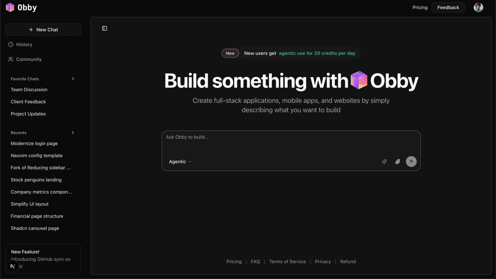

<p align="center">
  
  <h1 align="center">Obby – The AI Editor for the Web</h1>
</p>

<p align="center">
    Obby is a developer-first web editor powered by AI. It helps you design, build, and ship real apps from scratch.
</p>

## Getting started

### Clone the repo

```bash
git clone https://github.com/eersnington/obby-dev.git
```

### Navigate to the project directory

```bash
cd obby-dev
```

### Install dependencies

```bash
pnpm install
```

### Start the development server

```bash
pnpm run dev
```

## Tech stack

- Framework: Next.js
- Database: Convex
- Authentication: AuthKit by WorkOS
- Payments: Paddle


